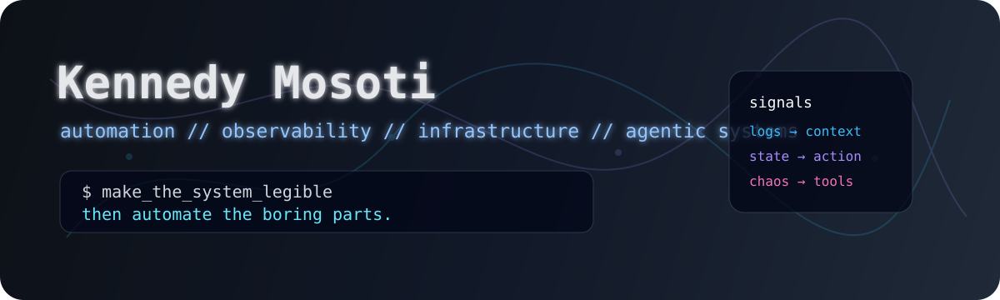
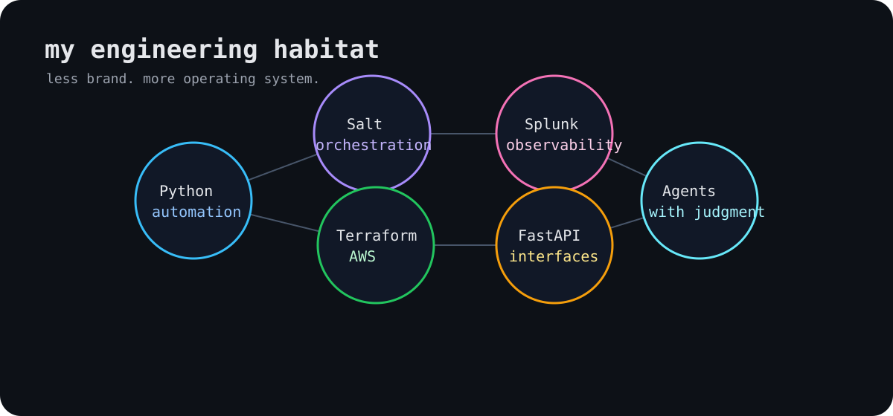
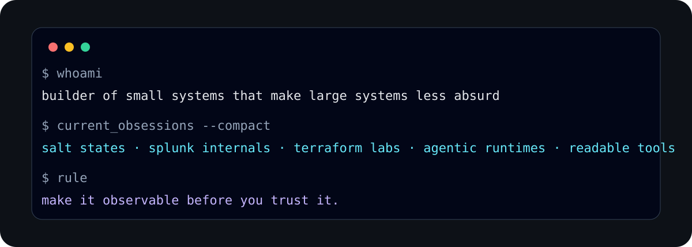

<p align="center">
  
</p>

---

I like systems that explain themselves.

Most of my work circles the same obsession from different angles:

```text
messy operations → observable systems
manual toil      → automation
tribal knowledge → reusable tooling
AI chaos         → deterministic interfaces
```

I work mostly around Python, Salt, Splunk, AWS, Terraform, Linux, and whatever glue is necessary to make infrastructure less hostile to human reasoning.

I’m not trying to make software feel magical.

I’m trying to make the machine admit what it is doing.

<p align="center">
  
</p>

---

### current fixations

* automation that does not become another thing to babysit
* observability as an interface for judgment
* agentic tooling with guardrails, state, and recovery
* infrastructure that stays legible after the original author leaves
* personal knowledge systems that are useful to both humans and machines

---

<p align="center">
  
</p>

### public fragments

* [`terraform-aws-splunk`](https://github.com/kmosoti/terraform-aws-splunk)
* [`terraform-aws-modular`](https://github.com/kmosoti/terraform-aws-modular)
* [`dave-discord-bot`](https://github.com/kmosoti/dave-discord-bot)
* [`valentine-hannah`](https://github.com/kmosoti/valentine-hannah)

---

> make the system legible.
> then automate the boring parts.
