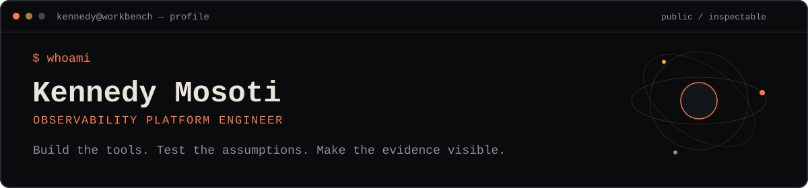
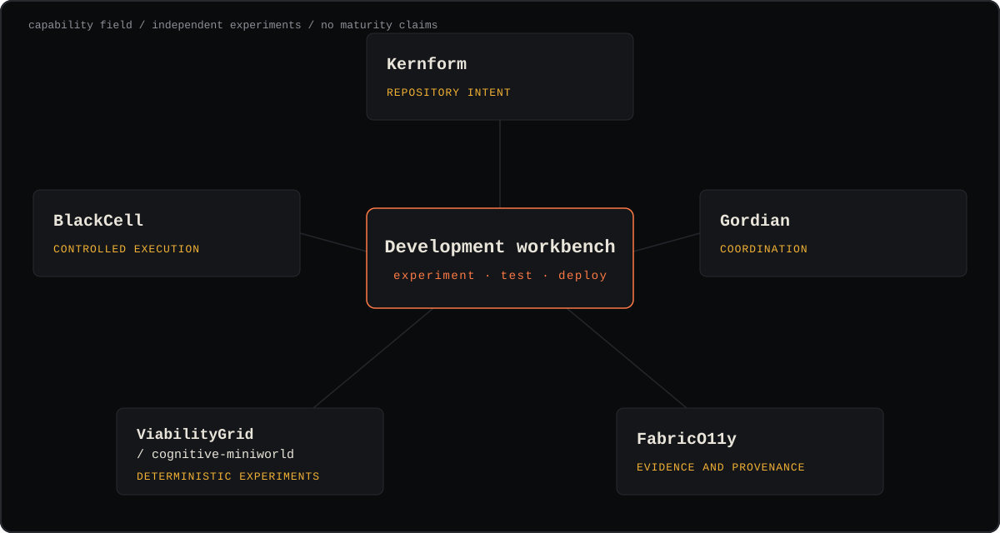

# Kennedy Mosoti

<picture>
  <source media="(max-width: 600px)" srcset="./assets/profile-hero-narrow.svg">
  
</picture>

This profile is a public workbench for the tools and experiments I am building.

The goal is a development ecosystem for quickly experimenting with, testing, and deploying software projects. Some pieces may fit together. Others may stay separate.

Most of the work starts with curiosity. Building it in public is also a way to become a more principled engineer: clearer boundaries, better tests, better evidence, and fewer hidden assumptions.

## Project field

<picture>
  <source media="(max-width: 600px)" srcset="./assets/project-field-narrow.svg">
  
</picture>

_The field groups independent experiments by the questions they address. It does not claim a production integration._

## Projects

<!-- profile:begin:projects -->
| Project | Role |
| --- | --- |
| [BlackCell](https://github.com/kmosoti/blackcell) | Plans, runs, reviews, verifies, and replays project-scoped coding-agent work. |
| [Kernform](https://github.com/kmosoti/Kernform) | Turns typed project intent into repeatable scaffolds and lifecycle commands. |
| [ViabilityGrid / cognitive-miniworld](https://github.com/kmosoti/cognitive-miniworld) | Tests cognitive mechanisms against simpler baselines in deterministic experiments. |
| [Gordian](https://github.com/kmosoti/gordian) | Coordinates intent, source state, execution, evidence, and acceptance. |
| [FabricO11y](https://github.com/kmosoti/FabricO11y) | Explores how to preserve observations, corrections, provenance, and incomplete answers. |
<!-- profile:end:projects -->

## Next

<!-- profile:begin:roadmap -->
- **Now:** Keep building and testing each project on its own.
- **Next:** See which pieces are worth connecting.
- **Later:** Use the pieces that hold up to revisit paused ideas, including [learning-os](https://github.com/kmosoti/learning-os).
<!-- profile:end:roadmap -->

<strong>How to read this workbench</strong>

I am developing and testing these projects independently. The field shows their areas of inquiry, not dependencies, maturity, or a finished toolchain. Useful connections can become explicit after they survive testing.

## Links

<!-- profile:begin:links -->
- Website: [kennedy.mosoti.dev](https://kennedy.mosoti.dev)
- Website source and build system: [ui-servo](https://github.com/kmosoti/ui-servo)
- [Résumé](./assets/kennedy-mosoti-resume.pdf)
- [Email](mailto:kennedy.rmosoti@gmail.com)
<!-- profile:end:links -->
