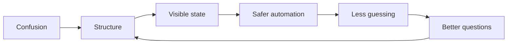

# Kennedy Mosoti

**Observability Platform Engineer - Infrastructure Automation - AI Tooling Experiments**

Dallas-Fort Worth, TX

> Systems should tell on themselves.

I work near messy platform systems and try to make them more legible: Splunk, Logstash, SaltStack, Linux, RCA, remediation, DR readiness, and small tools that reduce guessing.

I like infrastructure the way I like arguments: explicit, observable, and hard to bullshit.

The useful version of AI, to me, is not magic. It is better context, tighter tool contracts, visible diffs, validation, and fewer vague handoffs. I want agents that behave like constrained engineers, not confident mystery boxes with commit access.

## What I keep circling

That loop explains a lot of what I care about.

I do not mind mundane work. I mind mundane work that repeats forever, hides the real state of the system, and trains people to rely on memory instead of evidence.

## Current obsessions

- **Observability platform work:** Splunk, Logstash, Kafka ingestion paths, RCA, remediation, and platform health analysis.
- **Salt and infrastructure automation:** repeatable rollout paths, config boundaries, drift control, and safer operational changes.
- **tea-style doctrine:** a place to collect engineering rules before they dissolve back into vibes.
- **resume-builder:** structured resume data in, inspectable rendered output out.
- **Agent-safe tool boundaries:** schema validation, visible diffs, render checks, and failure modes before trust.

## Recent evidence

- Automated search-filter updates across **3,000+ Splunk roles**.
- Supported Salt-based Splunk automation across **100+ search heads**.
- Worked around Kafka, Logstash, Splunk ingestion paths, stale topic cleanup, and remediation.
- Investigated DR readiness gaps around cluster-manager and deployer workflows.
- Evaluated AI-generated Python, JavaScript, and SQL for correctness, maintainability, edge cases, and instruction following.

## Systems Notebook

My website is the main working surface now: **https://kmosoti.github.io/**

It is not meant to be a glossy portfolio. It is closer to a public notebook with taste: doctrine, field notes, diagrams, experiments, project labs, and whatever I am currently trying to understand.

Good entry points:

- [Signal](https://kmosoti.github.io/#signal) - what I am working near right now.
- [Work](https://kmosoti.github.io/#work) - concrete platform and automation evidence.
- [Systems Notebook](https://kmosoti.github.io/notebook/) - doctrine, field notes, diagrams, and experiments.
- [Project Labs](https://kmosoti.github.io/labs/) - unfinished repos framed by what is real, fragile, and next.
- [resume-builder sandbox](https://kmosoti.github.io/labs/resume-builder/sandbox.html) - a small browser demo for structured resume data and rendered output.

## Project labs

<strong>resume-builder</strong> - structured documents instead of formatter wrestling

Normal resume editing feels backwards. The content is structured, but people edit it like a fragile visual artifact. I would rather keep the truth in portable data and render the final document from that.

Current state: local tool plus static web sandbox.

Next honest improvement: real schema reuse, render checks, and visible diffs before trusting agent edits.

<strong>tea-style</strong> - doctrine engine, not a grand framework

tea-style is where I organize the principles, habits, and engineering patterns I keep collecting.

It should make thinking clearer. If it becomes another system to maintain for no reason, it has failed.

<strong>Agent-safe tool boundaries</strong> - useful agents need inspection ports

I am interested in agents that can act, but only inside explicit boundaries.

The useful version has schema validation, dry runs when risk matters, visible diffs, test output, render checks, and failure modes that do not require folklore.

## Operating rules

1. Do not build tools that require folklore.
2. Make mutations atomic and visible.
3. Keep config as intent, not hidden business logic.
4. Do not confuse a demo with a system.
5. Make state visible before humans start guessing.

> [!NOTE]
> A system that cannot describe its own state makes operators hallucinate one.

## Tools I tend to reach for

Python, SaltStack, Bash, Git, Terraform, Linux, Splunk Enterprise, Logstash, Kafka ingestion workflows, AWS, REST APIs, Markdown, and small deterministic interfaces.

## Links

- Website: https://kmosoti.github.io/
- Resume: [assets/kennedy-mosoti-resume.pdf](./assets/kennedy-mosoti-resume.pdf)
- Email: kennedy.rmosoti@gmail.com
