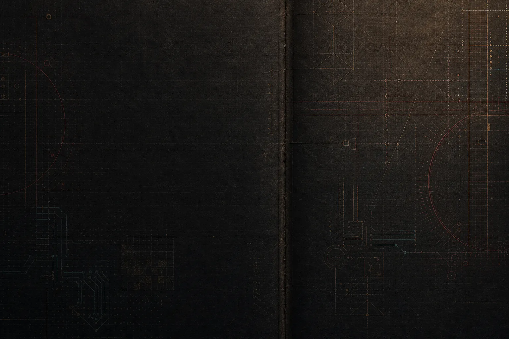

<p align="center">
  <a href="https://kmosoti.github.io/">
    
  </a>
</p>

# Kennedy Mosoti

**Observability Platform Engineer - Infrastructure Automation - AI Tooling Experiments**

Dallas-Fort Worth, TX

> Systems should tell on themselves.

I work near messy platform systems and try to make them more legible: Splunk, Logstash, SaltStack, Linux, RCA, remediation, DR readiness, and small tools that reduce guessing.

The useful version of AI, to me, is not magic. It is better context, tighter tool contracts, visible diffs, validation, and fewer vague handoffs.

## Current Signal

```text
confusion -> structure
hidden state -> telemetry
folklore -> interfaces
manual repetition -> automation
demo -> system
```

## Recent Evidence

- Automated search-filter updates across **3,000+ Splunk roles**.
- Supported Salt-based Splunk automation across **100+ search heads**.
- Worked around Kafka, Logstash, Splunk ingestion paths, stale topic cleanup, and remediation.
- Investigated DR readiness gaps around cluster-manager and deployer workflows.
- Evaluated AI-generated Python, JavaScript, and SQL for correctness, maintainability, edge cases, and instruction following.

## Systems Notebook

My website is the main working surface now:

- **Signal:** what I am working near right now.
- **Work:** concrete platform and automation evidence.
- **Systems Notebook:** doctrine, field notes, diagrams, and experiments.
- **Project Labs:** unfinished repos framed by what is real, fragile, and next.

Start here: **https://kmosoti.github.io/**

## Operating Notes

- Do not build tools that require folklore.
- Make mutations atomic and visible.
- Keep config as intent, not hidden business logic.
- Do not confuse a demo with a system.
- Make state visible before humans start guessing.

## Links

- Website: https://kmosoti.github.io/
- Resume: [assets/kennedy-mosoti-resume.pdf](./assets/kennedy-mosoti-resume.pdf)
- Email: kennedy.rmosoti@gmail.com
