<div align="center">

<h1>Kennedy Mosoti</h1>

<p>
  <strong>Observability Platform Engineer</strong><br>
  <sub>Infrastructure Automation / AI Tooling Experiments / Dallas-Fort Worth, TX</sub>
</p>

<p>
  <a href="https://kennedy.mosoti.dev/writing/"><kbd>systems notebook</kbd></a>
  <a href="https://kennedy.mosoti.dev/"><kbd>work evidence</kbd></a>
  <a href="https://kennedy.mosoti.dev/projects/"><kbd>project labs</kbd></a>
  <a href="assets/kennedy-mosoti-resume.pdf"><kbd>resume</kbd></a>
</p>

<!-- ui-servo:begin:header -->

<!-- ui-servo:end:header -->

</div>

---

> Systems should tell on themselves.

I work around systems that hide too much state and make tired people guess. Most of my professional work sits near Splunk, Logstash, SaltStack, Linux, RCA, remediation, DR readiness, and the small tools that make operational mess less mysterious.

I like infrastructure the way I like arguments: explicit, observable, and hard to bullshit.

I am an optimistic absurdist by temperament. The boulder is real. The hill is real. The correct response is still to instrument the slope.

## The questions I keep asking

```text
What's the data contract?
Is anyone using this code?
How can it be improved?
```

Those questions sound plain because they should be plain. A lot of operational pain starts when the important answers are implied, inherited, or trapped in somebody's head.

## What I am usually poking at

- Making hidden state visible before humans start inventing stories about it.
- Replacing repeated manual work with automation that can be reviewed.
- Pulling logic out of nested-if fog and giving it stronger shape.
- Treating personal documents and notes like artifacts worth rendering, validating, and improving.
- Figuring out where AI agents are useful without pretending confidence is a control plane.

## A little evidence

- Automated search-filter updates across **3,000+ Splunk roles**.
- Supported Salt-based Splunk automation across **100+ search heads**.
- Worked around Kafka, Logstash, Splunk ingestion paths, stale topic cleanup, and remediation.
- Investigated DR readiness gaps around cluster-manager and deployer workflows.
- Evaluated AI-generated Python, JavaScript, and SQL for correctness, maintainability, edge cases, and instruction following.

## The site

<!-- ui-servo:begin:site -->
**[kennedy.mosoti.dev](https://kennedy.mosoti.dev)** — a Rust/axum site exported to static files, served by Caddy on a 512MB droplet. Offline-capable, precompressed, and deployed by CI.

| | |
| --- | --- |
| Live release | [`a5a3e71`](https://github.com/kmosoti/ui-servo/commit/a5a3e71b5cf4f2769f80b4a1a80eb82d1c898c14) |
| Service worker | `3880c3ab9f46d6ed` |
| Deployed | 2026-08-11 |
<!-- ui-servo:end:site -->

## Systems Notebook

My website is the main working surface: **https://kennedy.mosoti.dev/**

It is not meant to be a glossy portfolio. It is closer to a public notebook with taste: doctrine, field notes, diagrams, experiments, project labs, and whatever I am currently trying to understand.

Good doors into it:

- [About](https://kennedy.mosoti.dev/about/) - current focus without turning the profile into a resume dump.
- [Work](https://kennedy.mosoti.dev/) - concrete platform and automation evidence.
- [Systems Notebook](https://kennedy.mosoti.dev/writing/) - doctrine, field notes, diagrams, and experiments.
- [Project Labs](https://kennedy.mosoti.dev/projects/) - unfinished repos framed by what is real, fragile, and next.

## Project ledger

<!-- ui-servo:begin:projects -->
| Project | Status | What it is |
| --- | --- | --- |
| **[BlackCell](https://github.com/kmosoti/blackcell)** | `pre-alpha` | Local-first, evidence-gated control runtime for coding agents. |
| **[splunk-dashboard-studio](https://github.com/kmosoti/splunk-dashboard-studio-python)** | `pre-alpha` | Pydantic 2 compiler/validator for Splunk Dashboard Studio, version-aware 9.4-10.4. |
| **Kernform** | `pre-alpha` | Deterministic project scaffolding and repo-conformance tool. Rust core, PyO3 bridge, Python SDK/CLI. |
| **[PraxisLedger](https://github.com/kmosoti/PraxisLedger)** | `early bootstrap` | Provenance and temporal knowledge graph. SQLite + Rust + Python. |
| **SAI** | `pre-alpha` | Agent routing modeled on brain-network dynamics. |
| **[learning-os](https://github.com/kmosoti/learning-os)** | `active` | Adaptive personal-learning app. FastAPI + SQLAlchemy. |

_Statuses are read from the site's own resume data, not retyped here. Nothing is past pre-alpha; when that changes this table changes with it._
<!-- ui-servo:end:projects -->

## Lab drawer

<details open>
<summary><strong>resume-builder</strong> - structured documents instead of formatter wrestling</summary>

Normal resume editing feels backwards. The content is structured, but people edit it like a fragile visual artifact. I would rather keep the truth in portable data and render the final document from that.

Current state: local tool plus static web sandbox.

Next honest improvement: real schema reuse, render checks, and visible diffs before trusting agent edits.

</details>

<details>
<summary><strong>tea-style</strong> - doctrine engine, not a grand framework</summary>

tea-style is where I organize the principles, habits, and engineering patterns I keep collecting.

It should make thinking clearer. If it becomes another system to maintain for no reason, it has failed.

</details>

<details>
<summary><strong>agent-safe tool boundaries</strong> - useful agents need inspection ports</summary>

I am interested in agents that can act, but only inside explicit boundaries.

The useful version has schema validation, dry runs when risk matters, visible diffs, test output, render checks, and failure modes that do not require folklore.

</details>

> [!NOTE]
> A system that cannot describe its own state makes operators hallucinate one.

## Links

- Website: https://kennedy.mosoti.dev/
- Resume: [assets/kennedy-mosoti-resume.pdf](./assets/kennedy-mosoti-resume.pdf)
- Email: kennedy.rmosoti@gmail.com
